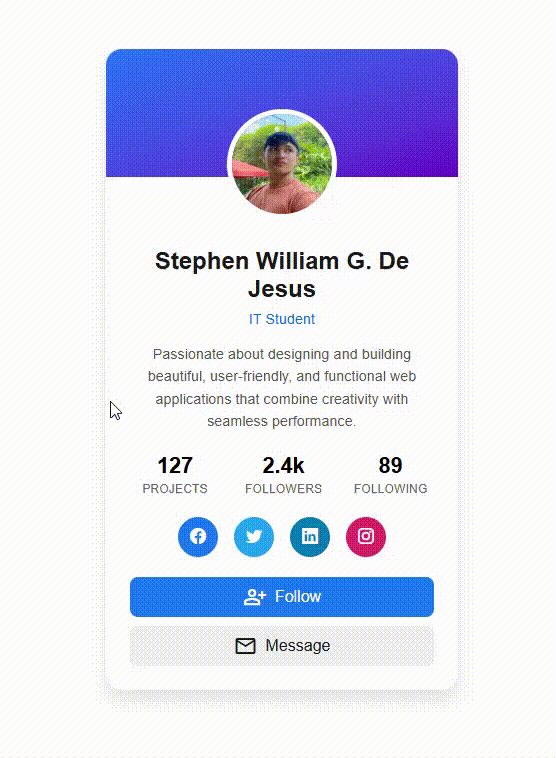

# 🪪 Profile Card

A sleek, accessible, and responsive **Profile Card** built using **HTML** and **CSS**.  
Designed by **Stephen William G. De Jesus**, this component showcases a user profile with basic info, stats, and social media links — perfect for portfolios, dashboards, or team sections in websites.

---

## 📸 Preview



---

## 🌐 Live Demo

[View Live Demo](https://bogiiiie.github.io/01-html-css-profile-card/)

---

## 📁 Features

✅ Responsive layout  
✅ Social media icons using [Bootstrap Icons](https://icons.getbootstrap.com/)  
✅ Google Fonts and Material Symbols integration  
✅ Hover effects for profile picture and buttons  
✅ ARIA labels and semantic roles for accessibility  
✅ Clean, modern UI design with smooth transitions

---

## 🛠️ Built With

- **HTML5** – for semantic and accessible structure  
- **CSS3** – for layout, theming, and transitions  
- **Bootstrap Icons** – for vector-based social media icons  
- **Google Fonts** – for material symbols and clean typography

---

## 🚀 Getting Started

To view or edit the project locally:

1. Clone the repo:
   ```bash
   git clone https://github.com/YOUR_USERNAME/01-html-css-profile-card.git
